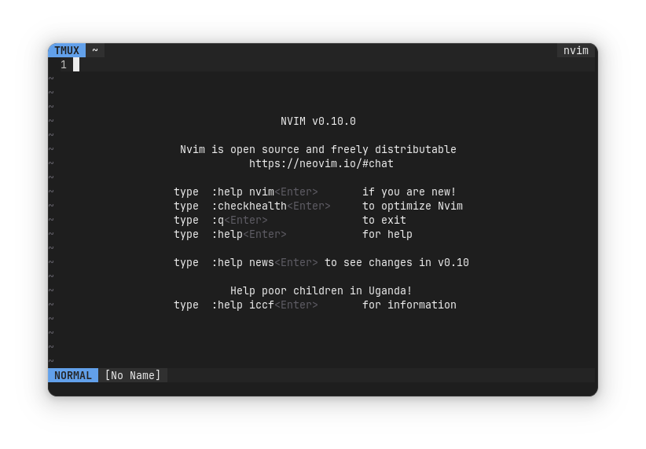
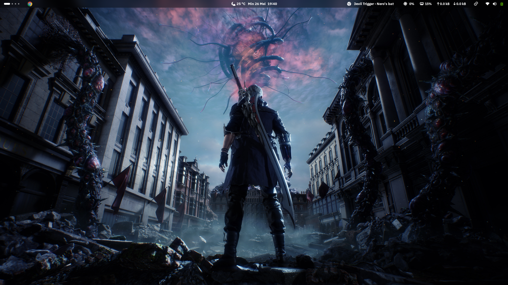
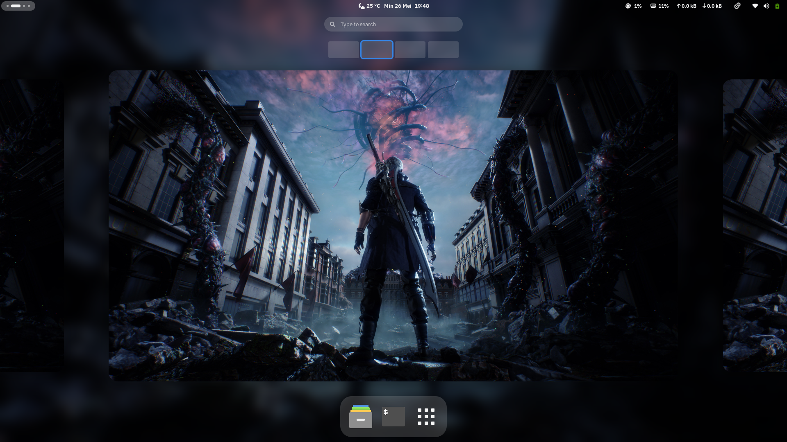
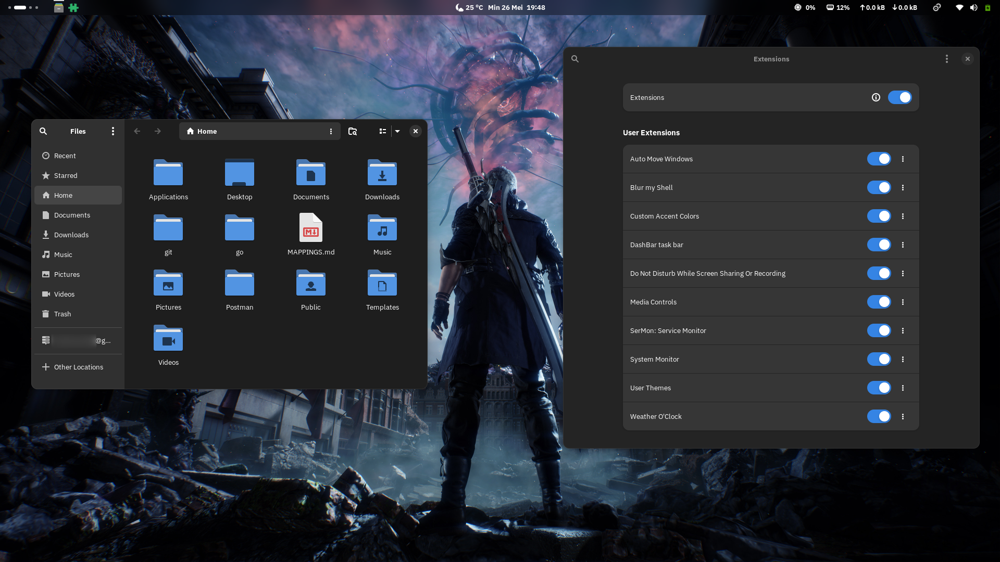
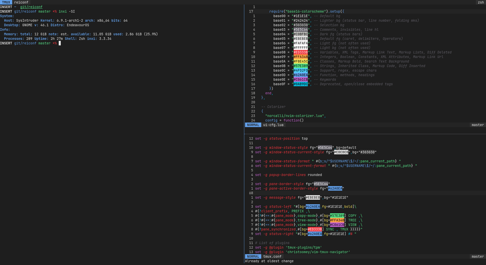

# Gnome Ricing

## UI
- Interface Font: [IBM Plex Sans](https://fonts.google.com/specimen/IBM+Plex+Sans)
- Terminal Font: [JetBrainsMono Nerd Font](https://www.nerdfonts.com/font-downloads)
- Icon: [Papirus](https://github.com/PapirusDevelopmentTeam/papirus-icon-theme)
- Folder: [Papirus Folder](https://github.com/PapirusDevelopmentTeam/papirus-folders) for changing folder color
- Wallpaper [Nero from DMC 5](https://4kwallpapers.com/games/nero-devil-may-cry-5-13858.html)

## Application
- [blackbox-terminal](https://gitlab.gnome.org/raggesilver/blackbox)
- [zsh](https://wiki.archlinux.org/title/zsh)
- [tmux](https://github.com/tmux/tmux/wiki)
- [neovim](https://neovim.io/)
- [lazygit](https://github.com/jesseduffield/lazygit)
- [fzf](https://github.com/junegunn/fzf)
- [ripgrep](https://github.com/BurntSushi/ripgrep)

## Configuration
- copy `blackbox` into `.local/share`
- copy `tmux` into `.config/`
- copy `nvim` into `.config/`
- copy `zsh` into `.config/`
- link `.zshrc` into `$HOME`
- add `ZDOTDIR=$HOME/.config/zsh` into `/etc/zsh/zshenv`
- remove nvm and turso from .zshrc if you don't use them

## Screenshots
| Home | Overview |
| --- | ----------- |
|  |  |

| Desktop | Terminal |
| --- | ----------- |
|  |  |
